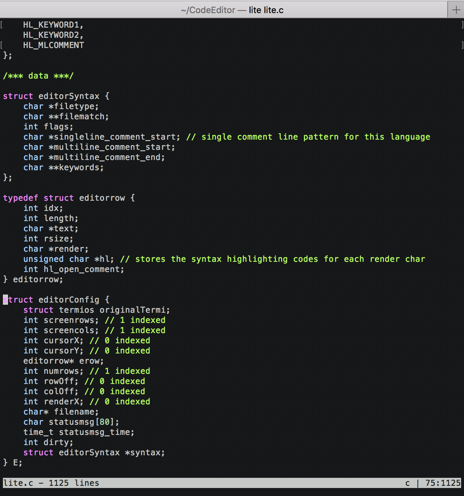

# :pencil2: Lite

Lite is a terminal based lightweight text editor built using only standard C libraries.



## Dependencies
Standard C libraries

## Installation

### Clone
Clone this repository by running the following command in a terminal:

```bash
$ git clone https://github.com/Sam1301/Lite.git
```

### Run
Run the following commands:

```bash
$ cd Lite && make
```

```bash
$ ./Lite filename
```

To create a new file run the following command instead:

```bash
$ ./Lite
```

## How to Use

| Command                      | Function           |
|------------------------------|--------------------|
| Ctrl+Q                       | Exit               |
| Ctrl+S                       | Save               |
| Ctrl+S + filename            | Save As            |
| Ctrl+F                       | Incremental Search |
| ESC                          | exit mode          |
| :arrow_left: / :arrow_up:    | search backward    |
| :arrow_right: / :arrow_down: | search forward     |

<br/>


## Issues

You can report the bugs at the [issue tracker](https://github.com/Sam1301/Lite/issues)

## References

* [Kilo](https://github.com/antirez/kilo) written by [Salvatore Sanfilippo](https://github.com/antirez/kilo)
* [ANSI_escape_code wiki](https://en.wikipedia.org/wiki/ANSI_escape_code)
* [VT100 user guide](https://vt100.net/docs/vt100-ug/chapter3.html)
